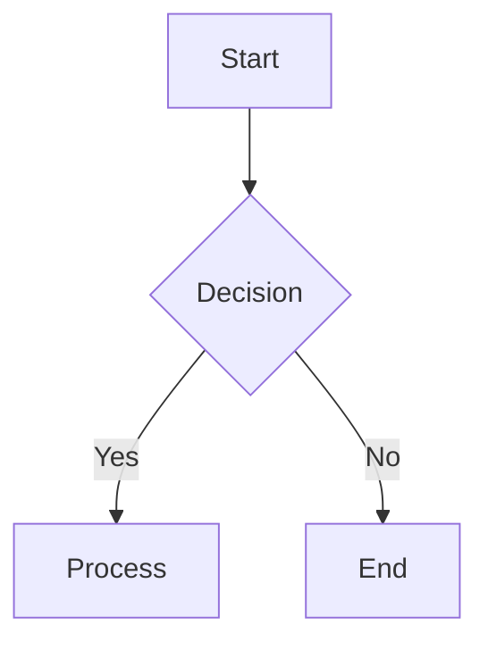

# Mermaid Agent

A modern, AI-powered Mermaid diagram editor with real-time preview, intelligent error fixing, and professional export capabilities. Built with Next.js 15, React 19, and the latest AI SDK v5.

## ✨ Features

### 🎨 **Real-time Diagram Editor**

- Live preview with syntax highlighting
- Resizable split-panel interface
- Theme-aware rendering (light/dark modes)
- Debounced rendering for optimal performance
- Support for all Mermaid diagram types

### 🤖 **AI-Powered Error Fixing**

- **Streaming AI repairs** using GPT-4o with real-time feedback
- **Tool-calling integration** with Mermaid validator
- **Multi-step iterative fixing** with automatic validation
- **Structured output** using AI SDK v5 experimental features
- **Modern streaming architecture** with proper error handling

### 📱 **Professional Interface**

- **Responsive design** with collapsible panels
- **Zoom and pan** controls for diagram navigation
- **Theme toggle** with system preference detection
- **File import/export** capabilities
- **Modern UI components** built with Radix UI

### 📥 **Export & Download**

- **High-quality PNG export** with multiple background options:
  - Light background (white)
  - Dark background (dark gray with grid)
  - Transparent background
- **Source code export** (.mmd format)
- **Preview generation** before download
- **2x DPI scaling** for crisp images

## 🚀 Getting Started

### Prerequisites

- Node.js 18+
- OpenAI API key for AI features

### Installation

1. **Clone and install dependencies:**

```bash
git clone <repository-url>
cd mermaid-viewer
npm install
```

2. **Configure environment:**

```bash
echo "OPENAI_API_KEY=your_openai_api_key_here" > .env.local
```

3. **Start development server:**

```bash
npm run dev
```

4. **Open the application:**
   Navigate to [http://localhost:3000](http://localhost:3000)

## 🏗️ Architecture

### Frontend Architecture

- **Next.js 15** with App Router and Turbopack
- **React 19** with modern hooks and concurrent features
- **TypeScript** for type safety
- **Tailwind CSS** with custom design system
- **Mermaid.js** for diagram rendering

### AI Integration

- **AI SDK v5** with streaming text generation
- **Tool calling** for iterative validation
- **Structured output** with Zod schemas
- **Real-time streaming** with ReadableStream API
- **Error handling** with proper lifecycle management

### Key Components

- `CodeEditor` - Monaco-based editor with AI integration
- `DiagramPreview` - Zoomable preview with export controls
- `DiagramDownloadDialog` - Advanced export interface
- `AgentPanel` - Real-time AI feedback and status

## 🛠️ Technology Stack

| Category             | Technology                          |
| -------------------- | ----------------------------------- |
| **Framework**        | Next.js 15, React 19                |
| **Language**         | TypeScript                          |
| **Styling**          | Tailwind CSS                        |
| **UI Components**    | Radix UI                            |
| **Diagrams**         | Mermaid.js 11+                      |
| **AI**               | OpenAI GPT-4o, AI SDK v5            |
| **State Management** | React hooks, Zustand-style patterns |
| **Build Tool**       | Turbopack                           |

## 🔧 API Endpoints

### `/api/agent` - AI-Powered Diagram Fixing

- **Method:** POST
- **Features:** Streaming responses, tool calling, structured output
- **Input:** Mermaid code + error description
- **Output:** Fixed code with explanations

### `/api/fix` - Alternative Fixing Endpoint

- **Method:** POST
- **Features:** Non-streaming alternative
- **Input:** Similar to agent endpoint
- **Output:** Validated fixed code

### `/api/workers-ai` - Cloudflare Workers AI Integration

- **Method:** GET
- **Features:** Alternative AI provider testing
- **Output:** NDJSON streaming format

## 📋 Usage Examples

### Basic Diagram Creation



### AI Error Fixing

1. Paste invalid Mermaid code
2. Click "Fix with AI" button
3. Watch real-time streaming fixes
4. Accept or modify the proposed solution

### Export Options

1. Click download button in preview panel
2. Choose background (light/dark/transparent)
3. Preview before download
4. Export as PNG or .mmd source

## 🔑 Environment Variables

```bash
# Required for AI features
OPENAI_API_KEY=your_openai_api_key

# Optional: Cloudflare Workers AI (for testing)
CLOUDFLARE_ACCOUNT_ID=your_account_id
CLOUDFLARE_API_TOKEN=your_api_token
```

## 🏗️ Development

### Build for Production

```bash
npm run build
npm start
```

### Linting

```bash
npm run lint
```

### Key Development Features

- **Hot reload** with Turbopack
- **Type checking** with TypeScript
- **Modern React** with concurrent features
- **AI SDK v5** with latest streaming APIs

## 🎯 Roadmap

- [ ] Multi-diagram workspace
- [ ] Collaborative editing
- [ ] Custom theme creation
- [ ] Advanced export formats (SVG, PDF)
- [ ] Plugin system for custom validators

## 📄 License

MIT License - see LICENSE file for details.

---

**Built with modern web technologies and AI-first architecture.**
