<div align="center">
  

# Mermaid Agent

  <p><strong>A modern Mermaid diagram editor with agentic error fixing and export capabilities.</strong></p>

[](https://nextjs.org/) [](https://react.dev/) [](https://www.typescriptlang.org/) [](https://mermaid.js.org/) [](https://sdk.vercel.ai/) [](https://tailwindcss.com/)

</div>

<div align="center">
  
</div>

## ✨ Features

### 🎨 **Real-time Diagram Editor**

- **Full Mermaid diagram support** including flowcharts, sequence diagrams, class diagrams, state diagrams, Gantt charts, ER diagrams, and more
- **Live preview** with syntax highlighting and instant validation
- **Resizable split-panel interface** with collapsible sections
- **Theme-aware rendering** supporting light/dark modes with system preference detection
- **Debounced rendering** for optimal performance during typing

### 🤖 **Multi-Agent AI Integration**

- **Multiple AI providers** with unified interface:
  - **OpenAI GPT-4.1** with streaming responses and tool calling
  - **Google Gemini AI** for alternative AI processing
  - **GPT-OSS** for open-source model testing
- **Real-time streaming architecture** with AI SDK v5
- **Tool-calling integration** with Mermaid validator for iterative fixing
- **Multi-step validation** with automatic error detection and correction
- **Structured output** using Zod schemas for type safety
- **Modern error handling** with proper lifecycle management

### 📱 **Professional Interface**

- **Responsive design** optimized for desktop and mobile
- **Zoom and pan controls** for precise diagram navigation
- **File import/export** with drag-and-drop support
- **Modern UI components** built with Radix UI primitives
- **Advanced export dialog** with preview and quality controls

### 📥 **Export & Download**

- **High-quality PNG export** with multiple background options:
  - Light background (white)
  - Dark background (dark gray with grid pattern)
  - Transparent background
- **Source code export** (.mmd format) for version control
- **Preview generation** before download confirmation
- **2x DPI scaling** for crisp, professional-quality images

### 🔧 **Advanced Validation**

- **Real-time Mermaid parsing** with detailed error reporting
- **Syntax highlighting** with error indicators
- **Intelligent error suggestions** powered by AI
- **Multi-pass validation** with tool-calling feedback loops

```mermaid
graph TD
    A[Code Input] --> B{Mermaid Parser}
    B -->|Success| C[Return valid ✓]
    B -->|Fails| D[Run lints for hints]
    D --> E[Return error + lint hints]
```

<div align="center">



</div>

The validation system uses a two-layer approach: first the Mermaid parser for authoritative syntax checking, then custom lint rules for actionable error hints when parsing fails.

## 🚀 Getting Started

### Prerequisites

- **Node.js 18+** for development
- **OpenAI API key** for AI-powered features

### Installation

1. **Clone and install dependencies:**

```bash
git clone https://github.com/devhims/mermaid-agent.git
cd mermaid-agent
pnpm install
```

2. **Configure Environment Variables in .env.local (for AI features):**

   ```bash
   # Primary AI Provider (OpenAI)
   OPENAI_API_KEY=your_openai_api_key

   # Alternative AI Providers (Optional)
   GOOGLE_GENERATIVE_AI_API_KEY=your_gemini_api_key
   CLOUDFLARE_ACCOUNT_ID=your_account_id
   CLOUDFLARE_API_TOKEN=your_api_token
   ```

3. **Start development server:**

   ```bash
   pnpm dev
   ```

4. **Open the application:**
   Navigate to [http://localhost:3000](http://localhost:3000)

## 🏗️ Architecture

### Frontend Architecture

- **Next.js 15** with App Router and Turbopack for optimal performance
- **React 19** with modern hooks and concurrent features
- **TypeScript** for complete type safety across the application
- **Tailwind CSS** with custom design system and component variants
- **Mermaid.js 11+** for robust diagram rendering and validation

### AI Integration Architecture

- **AI SDK v5** with streaming text generation and tool calling
- **Multi-provider support** with unified streaming interface
- **Tool calling system** for iterative validation and fixing
- **Structured output** with Zod schemas for response validation
- **Real-time streaming** with ReadableStream API for live updates
- **Error handling** with comprehensive lifecycle management

### Key Components

- **`CodeEditor`** - Monaco-based editor with AI integration and real-time validation
- **`DiagramPreview`** - Zoomable preview with pan/zoom controls and export options
- **`DiagramDownloadDialog`** - Advanced export interface with quality controls
- **`AgentPanel`** - Real-time AI feedback, status tracking, and result management
- **`MermaidValidator`** - Core validation engine with tool-calling capabilities

## 🛠️ Technology Stack

| Category             | Technology                                   | Purpose                                      |
| -------------------- | -------------------------------------------- | -------------------------------------------- |
| **Framework**        | Next.js 15                                   | Full-stack React framework with App Router   |
| **Runtime**          | React 19                                     | Modern React with concurrent features        |
| **Language**         | TypeScript 5                                 | Complete type safety and IDE support         |
| **Styling**          | Tailwind CSS 4                               | Utility-first CSS with custom design system  |
| **UI Components**    | Radix UI                                     | Accessible, unstyled UI primitives           |
| **Diagrams**         | Mermaid.js 11+                               | Professional diagram rendering and parsing   |
| **AI Integration**   | AI SDK v5                                    | Modern AI integration with streaming support |
| **AI Providers**     | OpenAI, Google Gemini, Cloudflare Workers AI | Multi-provider AI support                    |
| **State Management** | React hooks                                  | Modern React state patterns                  |
| **Build Tool**       | Turbopack                                    | Fast incremental builds and hot reload       |
| **Validation**       | Zod                                          | Runtime type validation and schemas          |

## 🔧 API Endpoints

### `/api/agent` - Primary AI-Powered Diagram Fixing

- **Method:** POST
- **Features:** Streaming responses, tool calling, structured output
- **AI Provider:** OpenAI GPT-4.1 with tool integration
- **Input:** Mermaid code + error description
- **Output:** Fixed code with step-by-step explanations

### `/api/gemini-ai` - Google Gemini AI Integration

- **Method:** POST
- **Features:** Alternative AI provider with Google Gemini models
- **Input:** Same as primary agent endpoint
- **Output:** Compatible streaming format with validation

### `/api/workers-ai` - Cloudflare Workers AI

- **Method:** POST
- **Features:** Edge-based AI processing
- **Input:** Mermaid code for processing
- **Output:** NDJSON streaming format

### `/api/gpt-oss` - Open Source Model Testing

- **Method:** POST
- **Features:** Testing endpoint for OSS models
- **Input:** Standard validation requests
- **Output:** Validation results and fixes

### AI Error Fixing Workflow

1. **Paste invalid Mermaid code** in the editor
2. **Click "Auto Fix" button** to initiate AI processing
3. **Watch real-time streaming** as the AI analyzes and fixes errors
4. **Review the proposed solution** with step-by-step explanations
5. **Accept or modify** the fix before applying to your code

### Export Options

1. **Click download button** in the preview panel
2. **Choose background** (light/dark/transparent)
3. **Preview** the export before downloading
4. **Export as PNG** with 2x DPI scaling or **source code** (.mmd format)

## 🏗️ Development

### Build for Production

```bash
pnpm build    # Build with Turbopack
pnpm start    # Start production server
```

### Development Commands

```bash
pnpm dev      # Start development server with hot reload
pnpm lint     # Run ESLint for code quality
pnpm build    # Build for production
```

## 🎯 Roadmap

- [ ] **Multi-diagram workspace** with tabbed interface
- [ ] **Collaborative editing** with real-time synchronization
- [ ] **Custom theme creation** with CSS variables
- [ ] **Advanced export formats** (SVG, PDF, WebP)
- [ ] **Plugin system** for custom validators and processors
- [ ] **Template library** with diagram templates
- [ ] **Version history** with undo/redo functionality
- [ ] **Custom Mermaid themes** and styling options

## 📄 License

MIT License - see LICENSE file for details.
