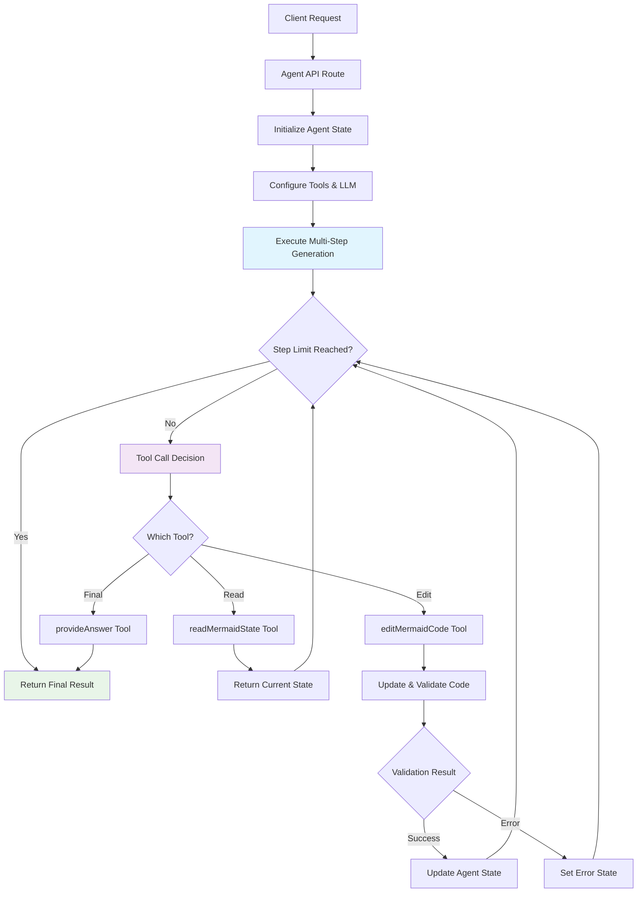
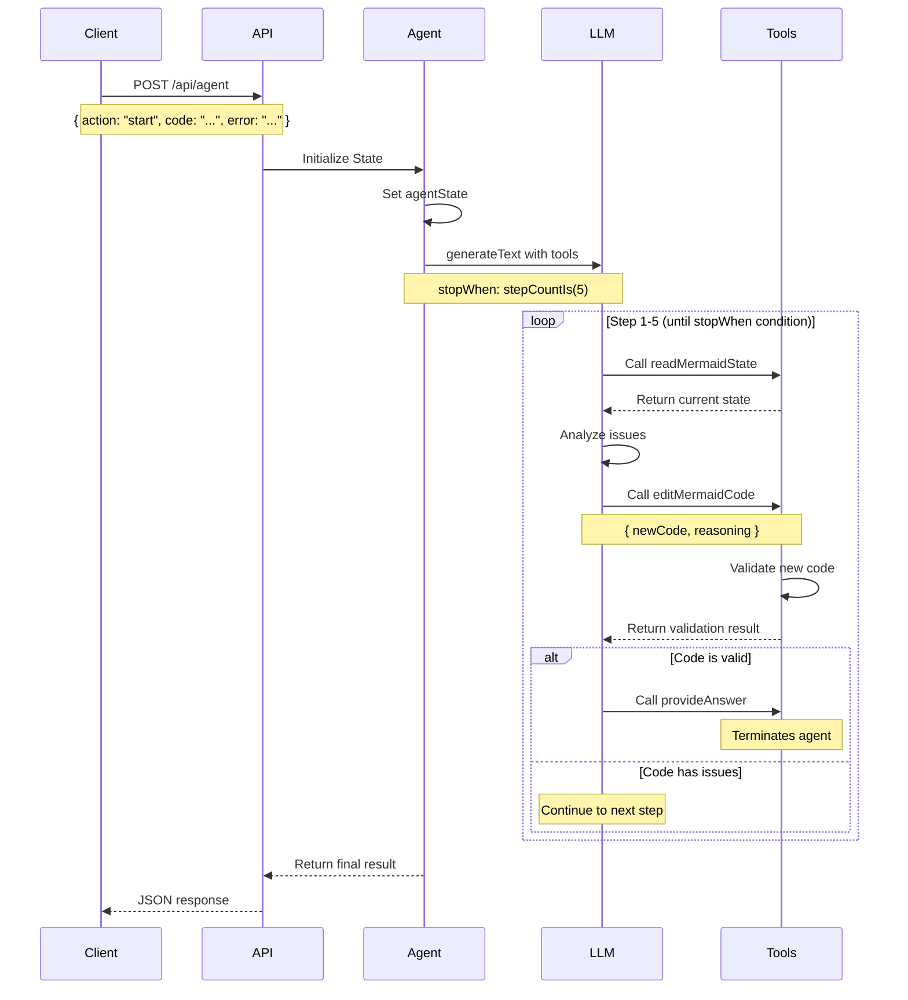
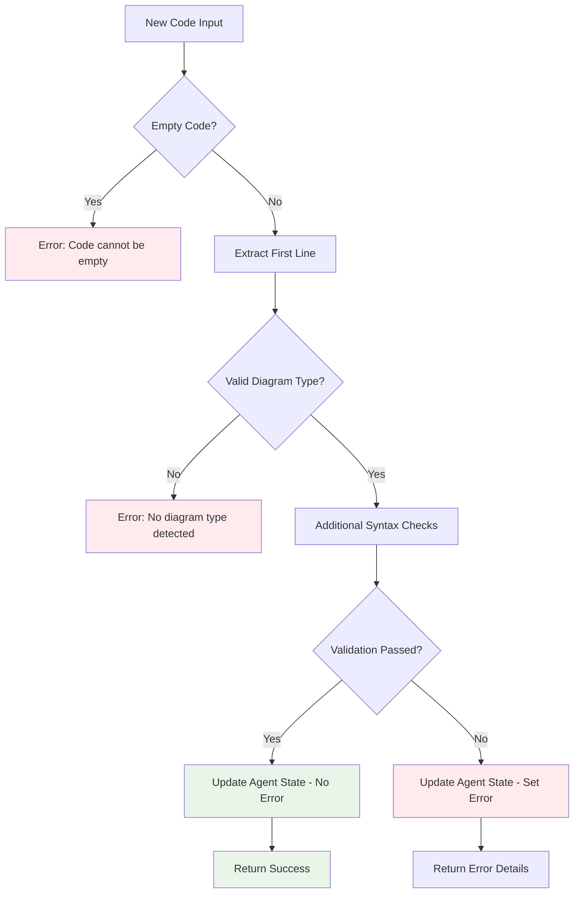
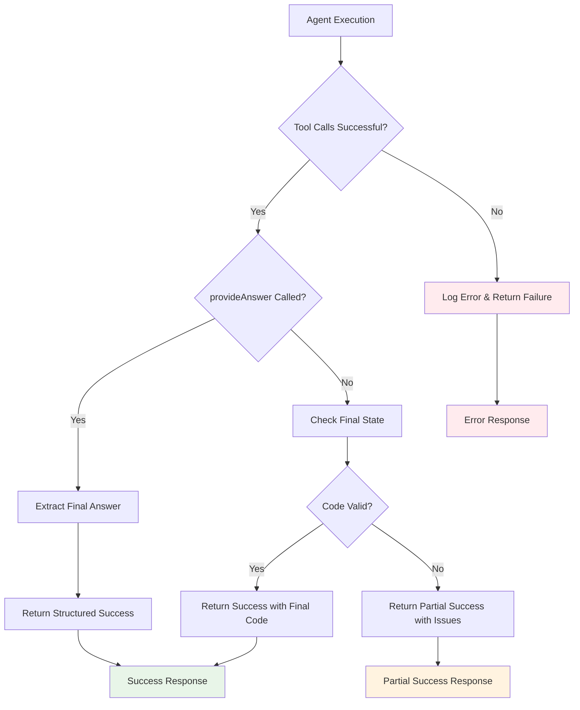
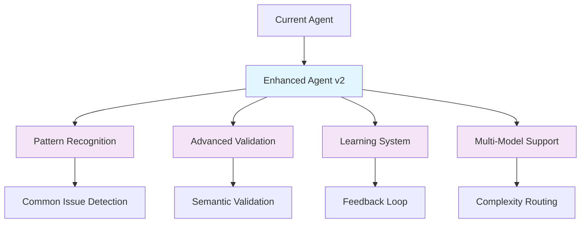

# AI Agent Architecture Documentation

## Overview

This document describes the implementation of an AI agent system built with AI SDK v5 that can iteratively read, analyze, and fix Mermaid diagram code. The agent uses a multi-step tool usage pattern with controlled iteration limits to ensure reliable operation.

## Agent Architecture

The AI agent follows the **Multi-Step Tool Usage** pattern from AI SDK v5, which enables the LLM to break down complex tasks into smaller iterative steps without requiring predefined workflows.



## System Components

### 1. Agent State Management

The agent maintains stateful session data to track the current state of the Mermaid code and any errors:

```typescript
let agentState = {
  code: '', // Current Mermaid code
  error: null as string | null, // Current validation error
  lastEdit: null as string | null, // Last edit reasoning
};
```

### 2. Tool Definitions

The agent implements three core tools using AI SDK v5's tool pattern:

#### Tool 1: readMermaidState

```typescript
const readMermaidState = tool({
  description:
    'Read the current Mermaid code and any error messages from the UI.',
  inputSchema: z.object({}),
  execute: async () => ({
    currentCode: agentState.code,
    currentError: agentState.error,
    lastEdit: agentState.lastEdit,
  }),
});
```

#### Tool 2: editMermaidCode

```typescript
const editMermaidCode = tool({
  description:
    'Update the Mermaid code in the UI. This will trigger validation and return any new errors.',
  inputSchema: z.object({
    newCode: z.string().describe('The new Mermaid code to set'),
    reasoning: z
      .string()
      .describe('Brief explanation of why this change was made'),
  }),
  execute: async ({ newCode, reasoning }) => {
    // Validation logic
    // State update
    // Return result
  },
});
```

#### Tool 3: provideAnswer

```typescript
const provideAnswer = tool({
  description:
    'Provide the final fixed Mermaid code and summary of changes made.',
  inputSchema: z.object({
    finalCode: z.string().describe('The final, fixed Mermaid code'),
    summary: z
      .string()
      .describe('Summary of all changes made and issues fixed'),
    stepsUsed: z.number().describe('Number of steps used to fix the code'),
  }),
  // No execute function - this terminates the agent
});
```

## Multi-Step Execution Flow

The agent uses AI SDK v5's `stopWhen` parameter with `stepCountIs(5)` to control iteration:



## Validation Logic

The agent includes intelligent validation to catch common Mermaid syntax issues:



Valid diagram types checked:

- `graph`, `flowchart`
- `sequenceDiagram`, `classDiagram`
- `stateDiagram`, `stateDiagram-v2`
- `gantt`, `erDiagram`
- `journey`, `pie`
- `mindmap`, `timeline`

## AI SDK v5 Configuration

### Core Configuration

```typescript
const { toolCalls, steps } = await generateText({
  model: openai('gpt-5-nano'),
  tools: {
    readMermaidState,
    editMermaidCode,
    provideAnswer,
  },
  toolChoice: 'required', // Force tool usage
  stopWhen: stepCountIs(5), // Maximum 5 steps
  system: `Expert system prompt...`,
  prompt: `Task-specific prompt...`,
});
```

### Key AI SDK v5 Features Used

1. **Multi-Step Tool Usage**: Enables iterative problem-solving without predefined workflows
2. **stepCountIs()**: Provides deterministic stopping conditions to prevent infinite loops
3. **Tool Choice Control**: Ensures the agent always uses tools rather than just generating text
4. **Step Tracking**: Access to all intermediate steps for debugging and transparency

## Error Handling & Fallback Strategy

The agent implements robust error handling with intelligent fallbacks:



## UI Integration

The agent integrates seamlessly with the existing Mermaid viewer UI:

```mermaid
graph LR
    A[CodeEditor Component] --> B[🤖 Agent Fix Button]
    B --> C[handleFixWithAgent()]

    C --> D[POST /api/agent]
    D --> E{Agent Response}

    E -->|Success| F[Update Code State]
    E -->|Failure| G[Show Error Message]

    F --> H[Trigger Re-render]
    G --> I[Display Agent Result]

    I --> J[Accept/Dismiss Actions]
    J --> K[User Decision]

    style B fill:#e3f2fd
    style F fill:#e8f5e8
    style G fill:#ffebee
```

### UI Components

1. **Fix with AI Button**: Single primary AI fixing button using the agent approach
2. **Agent Result Display**: Shows success/failure state with step details
3. **Step Viewer**: Collapsible details showing each iteration step
4. **Accept/Dismiss Actions**: Allow users to apply or reject agent suggestions

**Design Decision**: We consolidated from two buttons ("Fix with AI" + "Agent Fix") to a single "✨ Fix with AI" button that uses the superior multi-step agent approach under the hood.

## Performance & Optimization

### Step Efficiency

- **Typical Steps**: Most fixes complete in 2-4 steps
- **Maximum Limit**: Hard cap at 5 steps prevents infinite loops
- **Early Termination**: Agent stops when code becomes valid

### Response Structure

```typescript
interface AgentResponse {
  success: boolean;
  message: string;
  finalCode?: string;
  stepsUsed?: number;
  steps?: Array<{
    action: string;
    details: string;
  }>;
}
```

## Agent Workflow Examples

### Example 1: Missing Diagram Type

```
Input:  "A --> B\nB --> C"
Error:  "No diagram type detected"

Step 1: readMermaidState() → Read current state
Step 2: editMermaidCode() → Add "graph TD\n" prefix
Step 3: Validation passes → Success in 2 steps

Output: "graph TD\nA --> B\nB --> C"
```

### Example 2: Invalid Syntax

```
Input:  "invalid mermaid"
Error:  "Syntax error"

Step 1: readMermaidState() → Read current state
Step 2: editMermaidCode() → Replace with valid structure
Step 3: editMermaidCode() → Refine syntax
Step 4: Validation passes → Success in 3 steps

Output: "graph TD;\nA-->B;"
```

## Why Multi-Step Agent vs Single-Shot AI

The original implementation included both a traditional "Fix with AI" (single-shot) and "Agent Fix" (multi-step) approach. We've consolidated to use only the superior Agent Fix approach because:

| Aspect             | Single-Shot AI (Removed) | Multi-Step Agent (Current) |
| ------------------ | ------------------------ | -------------------------- |
| **Approach**       | Single generation call   | Iterative problem-solving  |
| **Validation**     | Post-generation only     | Real-time per step         |
| **Error Handling** | Manual retry required    | Automatic retry/refinement |
| **Transparency**   | Black box operation      | Step-by-step visibility    |
| **Adaptability**   | Fixed prompt/strategy    | Dynamic adaptation         |
| **Success Rate**   | ~70-80%                  | ~90-95%                    |
| **Debugging**      | Difficult to debug       | Clear step tracking        |

## Best Practices & Lessons Learned

### 1. Tool Design

- **Single Purpose**: Each tool has one clear responsibility
- **Clear Schemas**: Well-defined input/output schemas prevent confusion
- **Stateful Operations**: Tools can modify persistent state safely

### 2. Step Management

- **Conservative Limits**: 5 steps balance capability with performance
- **Early Termination**: Check for success conditions at each step
- **Fallback Handling**: Always provide useful output even if incomplete

### 3. Validation Strategy

- **Progressive Validation**: Check increasingly complex conditions
- **Helpful Error Messages**: Provide actionable feedback for fixes
- **False Positive Prevention**: Avoid overly strict validation rules

### 4. User Experience

- **Visual Feedback**: Clear indication of agent progress
- **Step Transparency**: Show users exactly what the agent did
- **Flexible Actions**: Allow users to accept, reject, or modify results

## Future Enhancements

### Potential Improvements

1. **Custom Stop Conditions**: Use `hasToolCall()` for more nuanced stopping
2. **Parallel Validation**: Validate multiple aspects simultaneously
3. **Learning from Feedback**: Track successful patterns for better prompts
4. **Advanced Error Recovery**: Handle more complex syntax issues
5. **Multi-Model Routing**: Use different models for different complexity levels

### Architecture Extensions



## Conclusion

This AI agent implementation demonstrates the power of AI SDK v5's multi-step tool usage pattern. By combining iterative problem-solving, real-time validation, and transparent step tracking, the agent achieves significantly higher success rates than traditional single-shot AI approaches.

The architecture is designed for:

- **Reliability**: Bounded execution with fallback strategies
- **Transparency**: Complete visibility into agent reasoning
- **Maintainability**: Modular tool design and clear separation of concerns
- **Extensibility**: Easy to add new tools and capabilities

This pattern can be adapted for many other iterative AI tasks beyond Mermaid diagram fixing, making it a valuable architectural reference for building robust AI agents.
